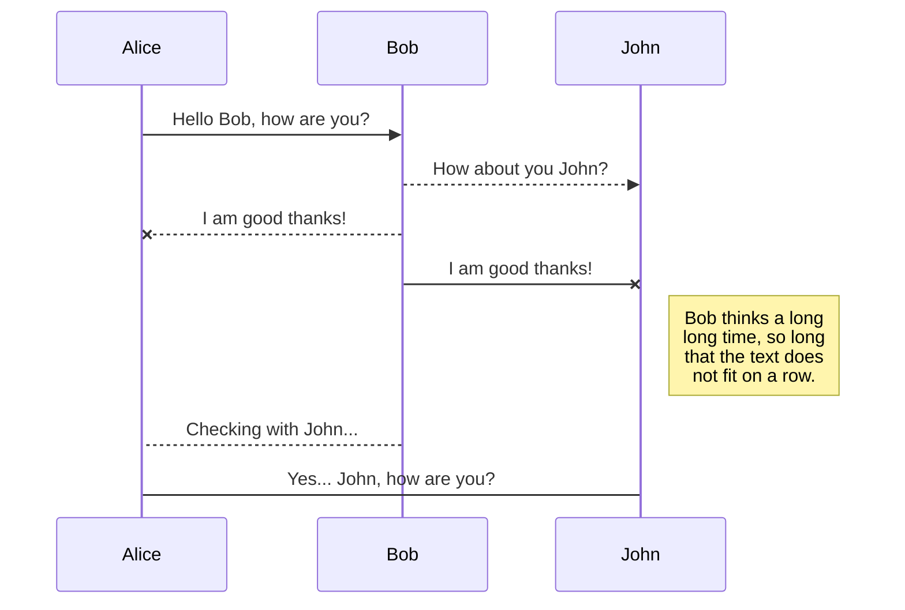
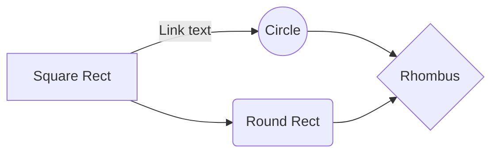

# Connecting Airflow& Fabric

**Solu1:**

User req -> Fabric Web -> Airflow API -> Fabric Network

**Solu2:**

User req -> Fabric Web -> Airflow DB & | Fabric Network


# Airflow API

Versions  **stable** and **experimental**.
stable: https://airflow.apache.org/docs/apache-airflow/stable/stable-rest-api-ref.html
Both developing.

## Authentication

```bash
$ airflow config get-value api auth_backend
airflow.api.auth.backend.basic_auth
```

## Connections

List connections

##### QUERY  PARAMETERS

limit

integer

Default: 100

The numbers of items to return.

offset

integer >= 0

The number of items to skip before starting to collect the result set.

order_by

string

The name of the field to order the results by. Prefix a field name with  `-`  to reverse the sort order.

## Tasks & DAGs

You can rename the current file by clicking the file name in the navigation bar or by clicking the **Rename** button in the file explorer.

### List

GET /dags

### Info

GET /dags/{dag_id}

### Update
PATCH /dags/{dag_id}

### Set/Clear state of task
POST  /dags/{dag_id}/clearTaskInstances
POST  /dags/{dag_id}/updateTaskInstances

# Airflow DB

## ERD Diagram

The following link displays all the tables from the Airflow database.
https://www.astronomer.io/guides/airflow-database

----------

## Tables

The Airflow metadata database has a total of 30 tables tables are stored on the public schema by default. The following describe the table structure and reference for the Airflow metadata tables.

### public.ab_permission

**Table Structure:**

----------

F-Key

Name

Type

Description

id

integer

_PRIMARY KEY_

name

character varying(100)

_UNIQUE NOT NULL_

**Tables referencing this one via Foreign Key Constraints:**

-   [public.ab_permission_view](https://www.astronomer.io/guides/airflow-database#public.ab_permission_view)

----------

### public.ab_permission_view

**Table Structure:**

----------

F-Key

Name

Type

Description

id

integer

_PRIMARY KEY_

[public.ab_permission.id](https://www.astronomer.io/guides/airflow-database#public.ab_permission)

permission_id

integer

_UNIQUE#1_

[public.ab_view_menu.id](https://www.astronomer.io/guides/airflow-database#public.ab_view_menu)

view_menu_id

integer

_UNIQUE#1_

**Tables referencing this one via Foreign Key Constraints:**

-   [public.ab_permission_view_role](https://www.astronomer.io/guides/airflow-database#public.ab_permission_view_role)

----------

### public.ab_permission_view_role

**Table Structure:**

----------

F-Key

Name

Type

Description

id

integer

_PRIMARY KEY_

[public.ab_permission_view.id](https://www.astronomer.io/guides/airflow-database#public.ab_permission_view)

permission_view_id

integer

_UNIQUE#1_

[public.ab_role.id](https://www.astronomer.io/guides/airflow-database#public.ab_role)

role_id

integer

_UNIQUE#1_

----------

### public.ab_register_user

**Table Structure:**

----------

F-Key

Name

Type

Description

id

integer

_PRIMARY KEY_

first_name

character varying(64)

_NOT NULL_

last_name

character varying(64)

_NOT NULL_

username

character varying(64)

_UNIQUE NOT NULL_

password

character varying(256)

email

character varying(64)

_NOT NULL_

registration_date

timestamp without time zone

registration_hash

character varying(256)

----------

### public.ab_role

**Table Structure:**

----------

F-Key

Name

Type

Description

id

integer

_PRIMARY KEY_

name

character varying(64)

_UNIQUE NOT NULL_

**Tables referencing this one via Foreign Key Constraints:**

-   [public.ab_permission_view_role](https://www.astronomer.io/guides/airflow-database#public.ab-permission_view_role)
-   [public.ab_user_role](https://www.astronomer.io/guides/airflow-database#public.ab_user_role)

----------

### public.ab_user

**Table Structure:**

----------

F-Key

Name

Type

Description

id

integer

_PRIMARY KEY_

first_name

character varying(64)

_NOT NULL_

last_name

character varying(64)

_NOT NULL_

username

character varying(64)

_UNIQUE NOT NULL_

password

character varying(256)

active

boolean

email

character varying(64)

_UNIQUE NOT NULL_

last_login

timestamp without time zone

login_count

integer

fail_login_count

integer

created_on

timestamp without time zone

changed_on

timestamp without time zone

[public.ab_user.id](https://www.astronomer.io/guides/airflow-database#public.ab_user)

created_by_fk

integer

[public.ab_user.id](https://www.astronomer.io/guides/airflow-database#public.ab_user)

changed_by_fk

integer

**Tables referencing this one via Foreign Key Constraints:**

-   [public.ab_user](https://www.astronomer.io/guides/airflow-database#public.ab_user)
-   [public.ab_user_role](https://www.astronomer.io/guides/airflow-database#public.ab_user_role)

----------

### public.ab_user_role

**Table Structure:**

----------

F-Key

Name

Type

Description

id

integer

_PRIMARY KEY_

[public.ab_user.id](https://www.astronomer.io/guides/airflow-database#public.ab_user)

user_id

integer

_UNIQUE#1_

[public.ab_role.id](https://www.astronomer.io/guides/airflow-database#public.ab_role)

role_id

integer

_UNIQUE#1_

----------

### public.ab_view_menu

**Table Structure:**

----------

F-Key

Name

Type

Description

id

integer

_PRIMARY KEY_

name

character varying(100)

_UNIQUE NOT NULL_

**Tables referencing this one via Foreign Key Constraints:**

-   [public.ab_permission_view](https://www.astronomer.io/guides/airflow-database#public.ab_permission_view)

----------

### public.alembic_version

**Table Structure:**

----------

F-Key

Name

Type

Description

version_num

character varying(32)

_PRIMARY KEY_

----------

### public.chart

**Table Structure:**

----------

F-Key

Name

Type

Description

id

serial

_PRIMARY KEY_

label

character varying(200)

conn_id

character varying(250)

_NOT NULL_

[public.users.id](https://www.astronomer.io/guides/airflow-database#public.users)

user_id

integer

chart_type

character varying(100)

sql_layout

character varying(50)

sql

text

y_log_scale

boolean

show_datatable

boolean

show_sql

boolean

height

integer

default_params

character varying(5000)

x_is_date

boolean

iteration_no

integer

last_modified

timestamp with time zone

----------

### public.connection

**Table Structure:**

----------

F-Key

Name

Type

Description

id

serial

_PRIMARY KEY_

conn_id

character varying(250)

conn_type

character varying(500)

host

character varying(500)

schema

character varying(500)

login

character varying(500)

password

character varying(500)

port

integer

extra

character varying(5000)

is_encrypted

boolean

is_extra_encrypted

boolean

----------

### public.dag

**Table Structure:**

----------

F-Key

Name

Type

Description

dag_id

character varying(250)

_PRIMARY KEY_

is_paused

boolean

is_subdag

boolean

is_active

boolean

last_scheduler_run

timestamp with time zone

last_pickled

timestamp with time zone

last_expired

timestamp with time zone

scheduler_lock

boolean

pickle_id

integer

fileloc

character varying(2000)

owners

character varying(2000)

description

text

default_view

character varying(25)

schedule_interval

text

root_dag_id

character varying(250)

**Indexes:**

-   **idx_root_dag_id**  root_dag_id

----------

### public.dag_pickle

**Table Structure:**

----------

F-Key

Name

Type

Description

id

serial

_PRIMARY KEY_

pickle

bytea

created_dttm

timestamp with time zone

pickle_hash

bigint

----------

### public.dag_run

**Table Structure:**

----------

F-Key

Name

Type

Description

id

serial

_PRIMARY KEY_

dag_id

character varying(250)

_UNIQUE#2 UNIQUE#1_

execution_date

timestamp with time zone

_UNIQUE#2_

state

character varying(50)

run_id

character varying(250)

_UNIQUE#1_

external_trigger

boolean

conf

bytea

end_date

timestamp with time zone

start_date

timestamp with time zone

**Indexes:**

-   **dag_id_state**  dag_id, state

----------

### public.import_error

**Table Structure:**

----------

F-Key

Name

Type

Description

id

serial

_PRIMARY KEY_

timestamp

timestamp with time zone

filename

character varying(1024)

stacktrace

text

----------

### public.job

**Table Structure:**

----------

F-Key

Name

Type

Description

id

serial

_PRIMARY KEY_

dag_id

character varying(250)

state

character varying(20)

job_type

character varying(30)

start_date

timestamp with time zone

end_date

timestamp with time zone

latest_heartbeat

timestamp with time zone

executor_class

character varying(500)

hostname

character varying(500)

unixname

character varying(1000)

**Indexes:**

-   **idx_job_state_heartbeat**  state, latest_heartbeat
-   **job_type_heart**  job_type, latest_heartbeat

----------

### public.known_event

**Table Structure:**

----------

F-Key

Name

Type

Description

id

serial

_PRIMARY KEY_

label

character varying(200)

start_date

timestamp without time zone

end_date

timestamp without time zone

[public.users.id](https://www.astronomer.io/guides/airflow-database#public.users)

user_id

integer

[public.known_event_type.id](https://www.astronomer.io/guides/airflow-database#public.known-event-type)

known_event_type_id

integer

description

text

----------

### public.known_event_type

**Table Structure:**

----------

F-Key

Name

Type

Description

id

serial

_PRIMARY KEY_

know_event_type

character varying(200)

**Tables referencing this one via Foreign Key Constraints:**

-   [public.known_event](https://www.astronomer.io/guides/airflow-database#public.known-event)

----------

### public.kube_resource_version

**Table Structure:**

----------

F-Key

Name

Type

Description

one_row_id

boolean

_PRIMARY KEY DEFAULT true_

resource_version

character varying(255)

**Constraints:**

Name

Constraint

kube_resource_version_one_row_id

CHECK (one_row_id)

----------

### public.kube_worker_uuid

**Table Structure:**

----------

F-Key

Name

Type

Description

one_row_id

boolean

_PRIMARY KEY DEFAULT true_

worker_uuid

character varying(255)

**Constraints:**

Name

Constraint

kube_worker_one_row_id

CHECK (one_row_id)

----------

### public.log

**Table Structure:**

----------

F-Key

Name

Type

Description

id

serial

_PRIMARY KEY_

dttm

timestamp with time zone

dag_id

character varying(250)

task_id

character varying(250)

event

character varying(30)

execution_date

timestamp with time zone

owner

character varying(500)

extra

text

**Indexes:**

-   **idx_log_dag**  dag_id

----------

### public.serialized_dag

**Table Structure:**

----------

F-Key

Name

Type

Description

dag_id

character varying(250)

_PRIMARY KEY_

fileloc

character varying(2000)

_NOT NULL_

fileloc_hash

integer

_NOT NULL_

data

json

_NOT NULL_

last_updated

timestamp with time zone

_NOT NULL_

**Indexes:**

-   **idx_filelo_hash**  fileloc_hash

----------

### public.sla_miss

**Table Structure:**

----------

F-Key

Name

Type

Description

task_id

character varying(250)

_PRIMARY KEY_

dag_id

character varying(250)

_PRIMARY KEY_

execution_date

timestamp with time zone

_PRIMARY KEY_

email_sent

boolean

timestamp

timestamp with time zone

description

text

notification_sent

boolean

**Indexes:**

-   **sm_dag**  dag_id

----------

### public.slot_pool

**Table Structure:**

----------

F-Key

Name

Type

Description

id

serial

_PRIMARY KEY_

pool

character varying(50)

_UNIQUE_

slots

integer

description

text

----------

### public.task_fail

**Table Structure:**

----------

F-Key

Name

Type

Description

id

serial

_PRIMARY KEY_

task_id

character varying(250)

_NOT NULL_

dag_id

character varying(250)

_NOT NULL_

execution_date

timestamp with time zone

_NOT NULL_

start_date

timestamp with time zone

end_date

timestamp with time zone

duration

integer

**Indexes:**

-   **idx_task_fail_dag_task_date**  dag_id, task_id, execution_date

----------

### public.task_instance

**Table Structure:**

----------

F-Key

Name

Type

Description

task_id

character varying(250)

_PRIMARY KEY_

dag_id

character varying(250)

_PRIMARY KEY_

execution_date

timestamp with time zone

_PRIMARY KEY_

start_date

timestamp with time zone

end_date

timestamp with time zone

duration

double precision

state

character varying(20)

try_number

integer

hostname

character varying(1000)

unixname

character varying(1000)

job_id

integer

pool

character varying(50)

_NOT NULL_

queue

character varying(256)

priority_weight

integer

operator

character varying(1000)

queued_dttm

timestamp with time zone

pid

integer

max_tries

integer

_DEFAULT '-1'::integer_

executor_config

bytea

**Tables referencing this one via Foreign Key Constraints:**

-   [public.task_reschedule](https://www.astronomer.io/guides/airflow-database#table-public.task-reschedule)

**Indexes:**

-   **ti_dag_date**  dag_id, execution_date
-   **ti_dag_state**  dag_id, state
-   **ti_job_id**  job_id
-   **ti_pool**  pool, state, priority_weight
-   **ti_state**  state
-   **ti_state_lkp**  dag_id, task_id, execution_date, state

----------

### Table public.task_reschedule

**Table Structure:**

----------

F-Key

Name

Type

Description

id

serial

_PRIMARY KEY_

[public.task_instance.task_id#1](https://www.astronomer.io/guides/airflow-database#public.task-instance)

task_id

character varying(250)

_NOT NULL_

[public.task_instance.dag_id#1](https://www.astronomer.io/guides/airflow-database#public.task-instance)

dag_id

character varying(250)

_NOT NULL_

[public.task_instance.execution_date#1](https://www.astronomer.io/guides/airflow-database#public.task-instance)

execution_date

timestamp with time zone

_NOT NULL_

try_number

integer

_NOT NULL_

start_date

timestamp with time zone

_NOT NULL_

end_date

timestamp with time zone

_NOT NULL_

duration

integer

_NOT NULL_

reschedule_date

timestamp with time zone

_NOT NULL_

**Indexes:**

-   **idx_task_reschedule_dag_task_date**  dag_id, task_id, execution_date

----------

### public.users

**Table Structure:**

----------

F-Key

Name

Type

Description

id

serial

_PRIMARY KEY_

username

character varying(250)

_UNIQUE_

email

character varying(500)

password

character varying(255)

superuser

boolean

**Tables referencing this one via Foreign Key Constraints:**

-   [public.chart](https://www.astronomer.io/guides/airflow-database#public.chart)
-   [public.known_event](https://www.astronomer.io/guides/airflow-database#public.known-event)

----------

### public.variable

**Table Structure:**

----------

F-Key

Name

Type

Description

id

serial

_PRIMARY KEY_

key

character varying(250)

_UNIQUE_

val

text

is_encrypted

boolean

----------

### public.xcom

**Table Structure:**

----------

F-Key

Name

Type

Description

id

serial

_PRIMARY KEY_

key

character varying(512)

value

bytea

timestamp

timestamp with time zone

_NOT NULL_

execution_date

timestamp with time zone

_NOT NULL_

task_id

character varying(250)

_NOT NULL_

dag_id

character varying(250)

_NOT NULL_

**Indexes:**

-   **idx_xcom_dag_task_date**  dag_id, task_id, execution_date

## Get total completed task count

```sql
SELECT COUNT(1)
FROM task_instance
WHERE
  state IS NOT NULL
  AND state NOT IN ('scheduled', 'queued');
```

## Get tasks started per hour for past week

```sql
SELECT
  date_trunc('hour', start_date) AS d,
  count(1)
FROM task_instance
GROUP BY d
ORDER BY 1 DESC
LIMIT 24*7;
```

## Get tasks finished per hour for past week

```sql
SELECT
  date_trunc('hour', end_date) AS d,
  count(1)
FROM task_instance
WHERE
  state IN ('skipped', 'success', 'failed')
  AND end_date IS NOT NULL
GROUP BY d
ORDER BY 1 DESC
LIMIT 24*7;
```

## Unpause a list of paused DAGs

```sql
UPDATE dag
SET is_paused = FALSE
WHERE
  is_paused is TRUE
  AND dag_id in (
    'clickstream_v2_to_redshift__xxx',
    'clickstream_v2_to_redshift__yyy',
    'clickstream_v2_to_redshift__zzz',
  );
```

## Pause all active DAGs and unpause with a temp table

We use this to be able to limit the impact of prod rollouts by only affecting one or two Astronomer DAGs before all customers.

Change  `dag_tmp`  to something unique and make sure it doesn't exist first.

```sql
SELECT dag_id
INTO dag_tmp
FROM dag
WHERE is_paused IS FALSE;

UPDATE dag
SET is_paused = TRUE
FROM dag_tmp
WHERE dag.dag_id = dag_tmp.dag_id;

UPDATE dag
SET is_paused = FALSE
FROM dag_tmp
WHERE dag.dag_id = dag_tmp.dag_id;

DROP TABLE dag_tmp;
```

## Delete a DAG completely

Deleting the DAG file itself leaves traces across 7 database tables, such as those for DAG runs and task instances.

Sometimes we need to completely blow out these rows for a certain DAG to re-run it from scratch, rewind the start date forward or backward, etc.

In the next release of Airflow after 1.9, a  [delete_dags command](https://stackoverflow.com/a/49683543/149428)  will be included in the CLI and REST API. For Airflow versions through 1.9, we have this.

```sql
delete from xcom where dag_id = 'my_dag_id';
delete from task_instance where dag_id = 'my_dag_id';
delete from sla_miss where dag_id = 'my_dag_id';
delete from log where dag_id = 'my_dag_id';
delete from job where dag_id = 'my_dag_id';
delete from dag_run where dag_id = 'my_dag_id';
delete from dag where dag_id = 'my_dag_id';
```

For Airflow 1.10, two additional tables have been added where the DAG also needs to be removed.

```sql
delete from xcom where dag_id = 'my_dag_id';
delete from task_instance where dag_id = 'my_dag_id';
delete from task_reschedule where dag_id = 'my_dag_id';
delete from task_fail where dag_id = 'my_dag_id';
delete from sla_miss where dag_id = 'my_dag_id';
delete from log where dag_id = 'my_dag_id';
delete from job where dag_id = 'my_dag_id';
delete from dag_run where dag_id = 'my_dag_id';
delete from dag where dag_id = 'my_dag_id';
```

## Rewinding a DAG

To rewind a DAG:

1.  Turn the DAG off in Airflow.
2.  Blow out the Airflow metadata for that DAG.
3.  The DAG will be automatically recreated and started from the new config.

If you blow out the metadata before the cache has updated, it will re-create the DAG with the old data.

## Fast Forwarding a DAG

You can fast forward a DAG by generating fake DAG runs in the Airflow metadata database.

First determine the timestamp of the latest DAG run:

```sql
-- NOTE: PAUSE THE DAG FIRST
-- change to your desired dag_id
select max(execution_date)
from dag_run
where dag_id = 'clickstream_v2_to_redshift__59ca877951ad6e2f93f870c5';
```

Take the timestamp output from the first query and add 1 hour (the output above was 5:15 AM, so 6:15 AM is used below), then put the new value where  _both_  of the timestamps are in the second query:

```sql
insert into dag_run(dag_id, execution_date, run_id, state)
values (
  'clickstream_v2_to_redshift__59ca877951ad6e2f93f870c5',
  '2018-04-27 06:15:00.000000',
  'scheduled__2018-04-27T06:15:00__fake',
  'failed'
);
```

If you want to go all the way up until (exclusive) 5/9/18 00:00 UTC, then the last fake DAG run to create is '2018-05-08 23:15:00.000000'.


And this will produce a flow chart:


